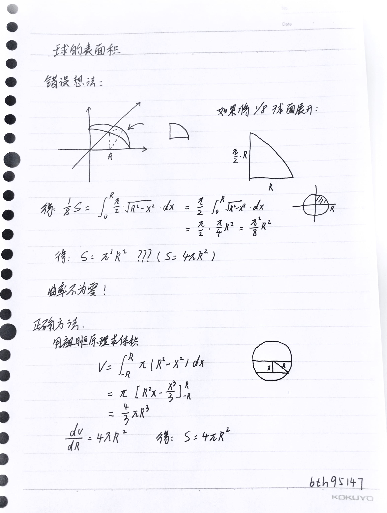

## 问题

计算半径为 $R$ 的球的表面积

## 错误想法

最初尝试把 $\frac18$ 球面“拉平”，认为可以用

$$
\text{面积} = (\text{一条方向的弧长}) \times (\text{另一方向长度})
$$

以为可以这样算

$$
\int \frac{\pi}{2} \sqrt{R^2 - x^2} \, dx
$$

但是不对，因为球的高斯曲率不为零，不能直接展开w

## 正确方法

想到祖暅原理

注意到

$$
V = \int_{-R}^{R} \pi (R^2 - x^2)\, dx
$$

得

$$
V = \frac{4}{3}\pi R^3
$$

对半径求导得

$$
\frac{dV}{dR} = 4\pi R^2
$$

当然还有其他方法，后续会补充的。

## 草稿纸

